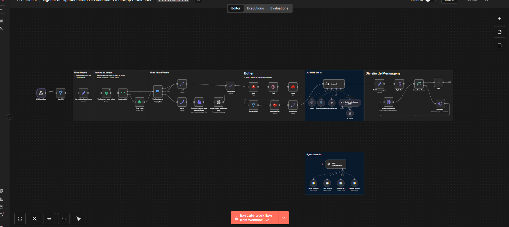

# 🤖 AI Clinic Assistant – Automação de Atendimento para Clínicas

Sistema de automação inteligente para atendimento de clínicas, utilizando **n8n, IA e integrações com APIs**, com foco em reduzir tarefas manuais e melhorar a experiência do cliente.

---

## 🚀 Sobre o Projeto

Este projeto consiste em um **agente automatizado de atendimento 24/7**, capaz de:

- Realizar **agendamentos automáticos**
- Gerenciar **cancelamentos e remarcações**
- Responder clientes com **IA conversacional**
- Integrar com banco de dados e calendário
- Funcionar fora do horário comercial

💡 O objetivo principal foi **reduzir carga operacional da equipe** e melhorar o tempo de resposta ao cliente.

---

## 📊 Resultados

- ⏱️ Redução de aproximadamente **60% no tempo de atendimento inicial**
- 📅 Automatização completa do processo de agendamento
- 🌙 Atendimento disponível **24 horas por dia**
- 📉 Redução significativa de tarefas manuais da equipe

---

## ⚙️ Tecnologias Utilizadas

### 🔗 Automação e Orquestração
- n8n (workflows e automações)

### 🤖 Inteligência Artificial
- OpenAI API (IA conversacional)

### 🗄️ Banco de Dados
- Supabase
- PostgreSQL

### 🧠 Memória Conversacional
- Redis

### 🔌 Integrações
- REST APIs
- Webhooks
- Google Calendar API

### 🐳 Infraestrutura
- Docker
- Portainer
- VPS (Hetzner)
- Cloudflare (DNS e domínio)

---

## 🔄 Funcionalidades

- ✔️ Atendimento automatizado via IA
- ✔️ Agendamento, cancelamento e remarcação
- ✔️ Integração com calendário (Google Calendar)
- ✔️ Armazenamento de dados de clientes
- ✔️ Histórico de conversas
- ✔️ Memória de contexto com Redis
- ✔️ Integração com APIs externas

---

## 🧩 Principais Desafios Resolvidos

- 🔻 Redução de processos manuais no atendimento
- 🔻 Organização de dados de clientes e histórico
- 🔻 Atendimento fora do horário comercial
- 🔻 Integração entre múltiplos sistemas
- 🔻 Escalabilidade do atendimento

---

## 🛠️ Como Funciona (Fluxo Simplificado)

1. Cliente inicia contato
2. IA interpreta a intenção (agendamento, dúvida, etc.)
3. Workflow no n8n processa a requisição
4. Sistema consulta banco de dados
5. Integra com APIs (ex: Google Calendar)
6. Retorna resposta automatizada ao cliente

---

## 📸 Demonstração

### 🔄 Workflow completo no n8n

💡 Esse fluxo mostra toda a orquestração da automação, incluindo:
- Entrada via webhook (WhatsApp)
- Normalização e tratamento de dados
- Processamento de mensagens (texto e áudio)
- Buffer de mensagens
- Integração com agente de IA
- Divisão e envio das respostas
- Módulo de agendamento com integração ao calendário

---

## 📌 Possíveis Melhorias

- Dashboard de monitoramento em tempo real
- Integração com CRM (HubSpot, Pipedrive, etc.)
- Sistema de notificações (WhatsApp / Email)
- Analytics de atendimento
- Otimização de prompts de IA

---

## 🚀 Sobre mim

Desenvolvido por **Pedro Lisboa**

- 💼 Desenvolvedor de Automação (n8n | IA | APIs)
- 🔗 LinkedIn: https://www.linkedin.com/in/pedrolisboacc/

---

## 📬 Contato

📧 pedroliscosmo27@gmail.com

---

## ⭐ Contribuição

Sinta-se à vontade para contribuir ou sugerir melhorias.

---

## 🧠 Observação

Este projeto demonstra como automação + IA podem ser aplicadas para gerar eficiência real em operações de negócio.
